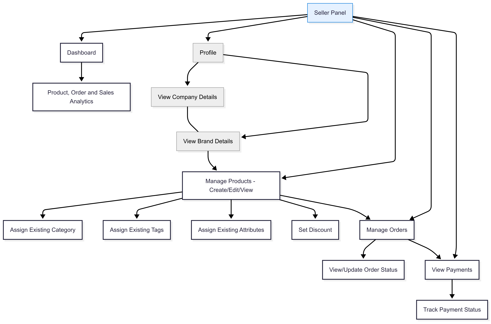
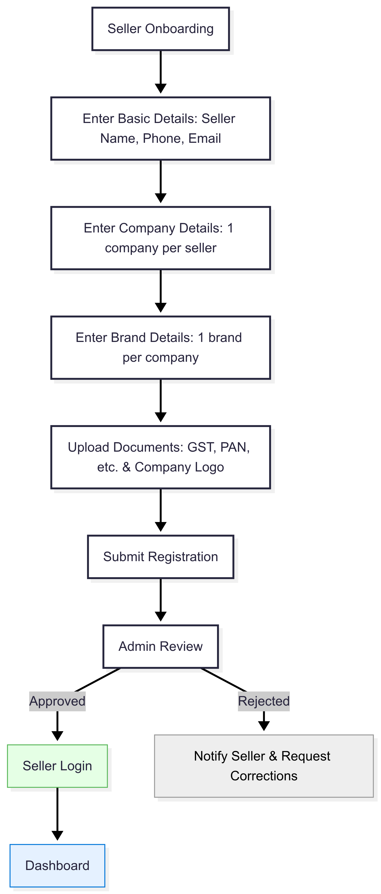

# Flow

This document provides the Mermaid source code for the **Workflow**.  
<!-- Copy the code block into the editor at https://www.mermaidchart.com/ to visualize or modify the diagram. -->

## If you want to visualize diagram

1. Navigate to https://www.mermaidchart.com/.  
2. Paste the entire Mermaid block above into the left-hand code editor.  
3. The diagram will render automatically in the preview pane.  
4. Export or fine-tune the chart as needed.

## Admin flow

```
flowchart LR
    A["Admin Panel"] --> DSH["Dashboard"] & C1["Manage Company - Create/Edit/View"] & P0["Manage Products - Create/Edit/View"] & MD1["Master Data Management"] & S1["Manage Sellers"] & D1["Manage Doctors"] & U1["Manage Customers"] & OMOD["Manage Orders"] & PMOD["Manage Payments"]
    DSH --> DA1["Product, Order, Coupon/Reward Usage and Sales Analytics"]
    C1 --> B1["Manage Brand - Create/Edit/View"]
    B1 --> B2["Assign Brand to Company - 1 Company to 1 Brand"]
    P0 --> P1["Assign Category"] & P2["Assign Tags"] & P3["Set Attributes"] & P4["Attach Discounts - Coupons/Rewards"]
    MD1 --> V1["Manage Categories - Create/Edit/View"] & V2["Manage Tags - Create/Edit/View"] & V3["Manage Attributes - Create/Edit/View"] & V4["Manage Discounts - Coupons and Rewards - Create/Edit/View"]
    S1 --> S2["Approve/Reject Seller"] & S3["View Seller KYC/Documents"] & S4["Onboarding Form - Create Seller"]
    D1 --> D2["Approve/Reject Doctor"] & D3["Verify Doctor"] & D4["Onboarding Form - Create Doctor"]
    U1 --> U2["View Purchase History"] & U3["Handle Support/Refund Requests"]
    OMOD --> O1["View/Cancel Orders"] & O2["Update Order Status"] & O3["Validate Discounts during Checkout"] & PMOD
    PMOD --> PM1["View Payments"] & PM2["Track Payment Status"] & PM3["Issue Refunds and Adjustments"] & PM4["Reconciliation & Reports"]
    B2 --> P0
    V4 --> O3
    N1["Note: Company and Brand have a 1-to-1 relationship"] --- B2
    N2["Note: Discounts include coupons and rewards"] --- V4

     C1:::Ash
     B1:::Ash
     B2:::Ash
     U2:::Ash
     U3:::Ash
     PM2:::Ash
     PM3:::Ash
     PM4:::Ash
     N1:::note
     N2:::note
    classDef note fill:#fff7e6,stroke:#ff9900,stroke-width:1px,stroke-dasharray:5 5
    classDef Ash stroke-width:1px, stroke-dasharray:none, stroke:#999999, fill:#EEEEEE, color:#000000
    style A fill:#e5f1ff,stroke:#0275d8,stroke-width:1px
    style S2 fill:#ffe5e5,stroke:#d9534f,stroke-width:1px
    style D2 fill:#ffe5e5,stroke:#d9534f,stroke-width:1px

```


## Seller flow

```
flowchart TD
    A["Seller Panel"] --> AB["Dashboard"] & B["Profile"] & F["Manage Products - Create/Edit/View"] & Q["Manage Orders"] & S["View Payments"]
    AB --> AC["Product, Order and Sales Analytics"]
    B --> C["View Company Details"] & D["View Brand Details"]
    C --- D
    F --> G["Assign Existing Category"] & H["Assign Existing Tags"] & I["Assign Existing Attributes"] & J["Set Discount"] & Q
    Q --> R["View/Update Order Status"] & S
    S --> T["Track Payment Status"]
    D --> F

     B:::Ash
     C:::Ash
     D:::relation
     D:::Ash
    classDef relation fill:none,stroke:#0275d8,stroke-width:1.5px,stroke-dasharray: 5 5
    classDef Ash stroke-width:1px, stroke-dasharray:none, stroke:#999999, fill:#EEEEEE, color:#000000
    style A fill:#e5f1ff,stroke:#0275d8,stroke-width:1px

```



## Customer flow

```
flowchart TD
    A["Customer Panel"] --> B["Profile Management"] & F["Browse Products"] & W2["View Wishlist"] & P["Give Ratings and Reviews"] & RT["Routine Module"] & PT["Routine Progress Tracker(dairy)"] & CM["Community"]
    B --> C["View/Update Personal Details"] & D["Manage Addresses"] & E["View Order History"] & p1["View Wishlist"]
    F --> G["Filter by Category"] & H["Filter by Brand"] & I["Search by Tags/Attributes"] & J["View Product Details"]
    J --> K["View Ratings - from Doctors and Customers"] & W1["Add to Wishlist"] & L["Add to Cart"]
    W2 --> W3["Move to Cart"] & W4["Remove from Wishlist"]
    W3 --> L
    L --> M["Place Order"]
    M --> X1["Apply Coupon/Reward/Discount"] & N["Make Payment"]
    N --> O["Track Order Status"]
    P --> Q["Rate Products"]
    RT --> S1["Step 1 - Define: name - description - benefits - time - visibility"]
    S1 --> S2["Step 2 - Add products by category - set pack size - expiry - expected benefits - days"]
    S2 --> S3["Step 3 - Reminders - choose routine - time"]
    S3 --> S4["Step 4 - Publish"]
    S4 --> RRule["Only one routine can be active"]
    PT --> T1["Daily check-in - take photo"]
    CM --> CQA["Ask Question - category - title - description - images"] & CBR["Browse/Search Questions"]
    CBR --> CRP["Reply - user or doctor"]
    CQA --> CIN["Like - Comment - Share"]
    X1 --> N
    T1 --> T2["Rate hydration - restorative - nourishing"]
    T2 --> T3["Report issues - add notes"]
    T4["Mark steps done"] --> T3
    CRP --> CIN

     RRule:::note
    classDef note fill:#fff7e6,stroke:#ff9900,stroke-width:1px,stroke-dasharray:5 5
    classDef Ash stroke-width:1px, stroke-dasharray:none, stroke:#999999, fill:#EEEEEE, color:#000000
```


## Seller onboarding flow

```
flowchart TD
    A["Seller Onboarding"] --> B["Enter Basic Details: Seller Name, Phone, Email"]
    B --> C["Enter Company Details: 1 company per seller"]
    C --> D["Enter Brand Details: 1 brand per company"]
    D --> E["Upload Documents: GST, PAN, etc. & Company Logo"]
    E --> F["Submit Registration"]
    F --> G["Admin Review"]
    G -- Approved --> H["Seller Login"]
    G -- Rejected --> I["Notify Seller & Request Corrections"]
    H --> J["Dashboard"]

     I:::Ash
    classDef Ash stroke-width:1px, stroke-dasharray:none, stroke:#999999, fill:#EEEEEE, color:#000000
    style H fill:#e5ffe5,stroke:#5cb85c,stroke-width:1px
    style J fill:#e5f1ff,stroke:#0275d8,stroke-width:1px
```



## Routine Builder + Progress Tracker

```
flowchart TD
    A[Routine Module] --> B[Create Routine]

    %% Step 1
    B --> S1[Step 1 - Define Routine]
    S1 --> S1a[Enter name and description]
    S1 --> S1b[Select benefits - hydrating - restorative - nourishing - etc]
    S1 --> S1c[Select routine time - morning or evening]
    S1 --> S1d[Select visibility - public or private]

    %% Step 2
    S1 --> S2[Step 2 - Add products by category]
    S2 --> C1[Morning categories - cleanser - moisturiser - sunscreen - toner - oil - etc]
    C1 --> P1[Add product to a category]
    P1 --> P1a[Set pack size]
    P1 --> P1b[Set expires on]
    P1 --> P1c[Select expected benefits]
    P1 --> P1d[Select days to apply - Mon to Sun]
    P1 --> P1e{Add another product?}
    P1e -->|Yes| P1
    P1e -->|No| S3

    %% Step 3
    S3[Step 3 - Reminder] --> S3a[Select routine to remind - morning or evening]
    S3a --> S3b[Set reminder time]

    %% Step 4
    S3 --> S4[Step 4 - Publish]
    S4 --> D1{Any other active routine?}
    D1 -->|Yes| D2[Prompt to deactivate or replace active routine]
    D2 --> D3{Confirm replace?}
    D3 -->|Yes| D4[Deactivate previous routine - Activate new routine]
    D3 -->|No| D5[Save as draft]
    D1 -->|No| D6[Activate routine]

    %% Rule note
    N[Only one routine can be active] --- S4

    %% Progress Tracker
    A --> PT[Progress Tracker]
    PT --> R1[Select active routine]
    R1 --> R2[Daily check-in]
    RN[Reminder notification] --> R2

    R2 --> T1[Take photo]
    R2 --> T2[Rate hydration - restorative - nourishing]
    R2 --> T3[Report skin issues faced today]
    R2 --> T4[Add notes]
    R2 --> T5[Mark steps done - per scheduled categories and days]

    T1 --> SAVE[Save progress]
    T2 --> SAVE
    T3 --> SAVE
    T4 --> SAVE
    T5 --> SAVE

    %% Styling
    classDef ruleNote fill:#fff7e6,stroke:#ff9900,stroke-width:1px,stroke-dasharray:5 5;
    class N ruleNote;
    style SAVE fill:#e5f1ff,stroke:#0275d8,stroke-width:1px

```


##  Community module
It shows that Users and Doctors can both ask and reply, supports categories, description, and multiple images, and keeps everything flat (no subgraphs).

```
flowchart TD
    A[Community Module] --> B[Choose action]
    B -->|Ask a question| C[Ask Question]
    B -->|Browse questions| D[Browse & Search Questions]

    %% Ask flow
    C --> C1[Select category - general - routine - product - review]
    C --> C2[Enter question title]
    C --> C3[Enter description]
    C --> C4[Attach multiple images]
    C --> C5[Submit question]
    C5 --> QP[Question published]

    %% Browse & reply flow
    D --> L1[List questions with filters]
    L1 --> QV[Open question]
    QV --> R1[Write reply - by user or doctor]
    R1 --> R2[Attach images - optional]
    R2 --> R3[Submit reply]
    R3 --> RP[Reply published]

    %% Interactions
    QV --> I1[Like question]
    QV --> I2[Comment on question]
    QV --> I3[Share question]
    RP --> I4[Like reply]
    RP --> I5[Comment on reply]
    RP --> I6[Share reply]

    %% Cross-links
    QP --> QV

    %% Role note
    RN[Both users and doctors can ask, reply, like, comment, and share - like Stack Overflow] --- A

    %% Styling
    classDef note fill:#fff7e6,stroke:#ff9900,stroke-width:1px,stroke-dasharray:5 5;
    class RN note;
```


