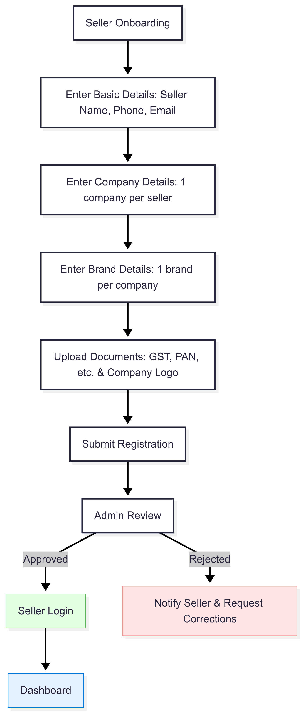

# Seller onboarding

```
flowchart TD
    A["Seller Onboarding"] --> B["Enter Basic Details: Seller Name, Phone, Email"]
    B --> C["Enter Company Details: 1 company per seller"]
    C --> D["Enter Brand Details: 1 brand per company"]
    D --> E["Upload Documents: GST, PAN, etc. & Company Logo"]
    E --> F["Submit Registration"]
    F --> G["Admin Review"]
    G -- Approved --> H["Seller Login"]
    G -- Rejected --> I["Notify Seller & Request Corrections"]
    H --> J["Dashboard"]

    style H fill:#e5ffe5,stroke:#5cb85c,stroke-width:1px
    style I fill:#ffe5e5,stroke:#d9534f,stroke-width:1px
    style J fill:#e5f1ff,stroke:#0275d8,stroke-width:1px
```
